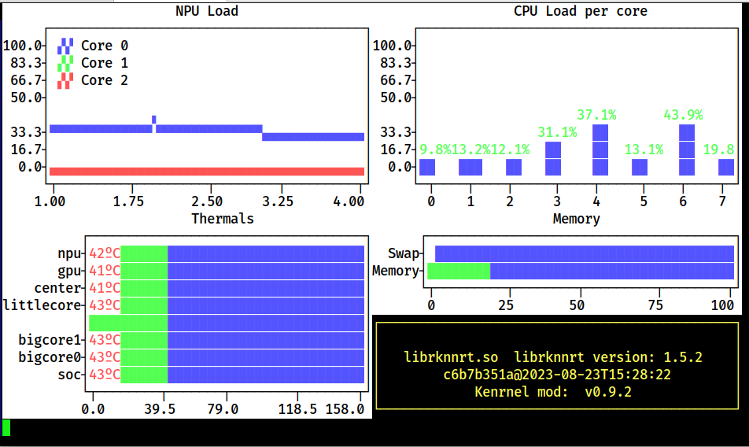

# rktop
Simple top-like script for Rockhip NPUs on Linux

## Installing
### Quick Install 
Debian/Ubuntu only (requires apt):

`curl https://raw.githubusercontent.com/Donbumo/rktop/main/install.sh | sudo bash`

### Manual Install

Required:
`sudo pip install rich psutil`

Then download (for example with `wget`)

`wget https://raw.githubusercontent.com/Donbumo/rktop/main/rktop`

## Running

If you followed quick install, just enter `sudo rktop` on your shell

### Manual

`chmod +x rktop`

`sudo ./rktop`

## Proximamente

parameters for cli
RGA support 
hot keys for UI

## Screenshots

